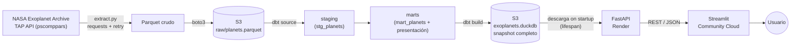

# 🪐 Exoplanets

Pipeline de datos end-to-end sobre los ~6,300 exoplanetas confirmados del
[NASA Exoplanet Archive](https://exoplanetarchive.ipac.caltech.edu/): extracción,
almacenamiento en la nube, transformación con dbt, exposición vía API y
visualización interactiva.

Proyecto de portfolio construido para practicar ingeniería de datos de punta a
punta — no solo el pipeline, sino también las decisiones de arquitectura,
trade-offs, testing y despliegue que lo rodean.


**🔗 API en vivo (Swagger):** https://exoplanets-uiu5.onrender.com/docs
**🔗 Dashboard:** _(agregar aquí la URL de Streamlit Community Cloud una vez desplegado)_

> ⚠️ **Sobre el cold start:** tanto la API (Render) como el frontend (Streamlit
> Community Cloud) corren en tier gratuito y se "duermen" tras inactividad
> (~15 min la API, ~12h el frontend). La primera carga puede tardar 30-60
> segundos mientras el contenedor entero de la API vuelve a levantar (la
> descarga del `.duckdb` en sí es rápida, pesa solo 9 MB).

---

## Índice

1. [Descripción general](#1-descripción-general)
2. [Arquitectura](#2-arquitectura)
3. [Stack tecnológico](#3-stack-tecnológico)
4. [Decisiones técnicas y trade-offs](#4-decisiones-técnicas-y-trade-offs)
5. [Modelo de datos](#5-modelo-de-datos)
6. [Testing y CI/CD](#6-testing-y-cicd)
7. [Despliegue](#7-despliegue)
8. [Cómo correrlo en local](#8-cómo-correrlo-en-local)
9. [Estructura del repositorio](#9-estructura-del-repositorio)
10. [Bugs reales encontrados (y qué enseñaron)](#10-bugs-reales-encontrados-y-qué-enseñaron)
11. [Limitaciones conocidas](#11-limitaciones-conocidas)
12. [Qué sigue (v2)](#12-qué-sigue-v2)

---

## 1. Descripción general

Los exoplanetas confirmados que conocemos no son una muestra representativa
del universo — son los que nuestra tecnología actual pudo detectar. Ese sesgo
de observación aparece una y otra vez en los datos (concentración en
detecciones cercanas, dominancia del método de tránsito, picos de
confirmación en años puntuales) y es el hilo conductor del análisis que
expone el dashboard.

El proyecto cubre el stack completo:

```
NASA API → extract (Python) → S3 (raw) → dbt/DuckDB (transform) →
S3 (snapshot) → FastAPI → Streamlit
```

Cada capa tiene su propia justificación técnica — no es una lista de
tecnologías de moda, son decisiones tomadas (y documentadas) una por una a lo
largo del proyecto. La sección 4 explica el porqué de cada una.

## 2. Arquitectura



**Flujo, paso a paso:**

1. **Extracción** — `extract.py` llama a la API TAP de NASA (tabla
   `pscomppars`), con manejo de errores y reintentos ante fallos de red.
2. **Raw a S3** — los datos se guardan primero como Parquet local (se valida
   que todo funcione antes de tocar AWS), luego se suben a S3 con un usuario
   IAM de permisos mínimos (`exoplanetas_pipeline`).
3. **Transformación** — dbt-duckdb lee ese Parquet como source y lo procesa
   en dos capas: `staging` (limpieza, tipado, renombrado) → `marts`
   (columnas calculadas, clasificaciones, agregaciones). Corre tests de
   `not_null`, `unique`, `relationships` y `accepted_values` en cada build.
4. **Snapshot a S3** — `dbt build` deja un `.duckdb` completo y
   materializado, que se sube a S3 como snapshot único. No hay lecturas
   live a S3 por request.
5. **API** — FastAPI descarga ese `.duckdb` al arrancar (patrón `lifespan`)
   y sirve todo desde el archivo local, con un usuario IAM de solo lectura
   (`exoplanetas_api`) y conexiones DuckDB `read_only=True` por request.
6. **Frontend** — Streamlit consume la API vía `requests`, cachea las
   respuestas (`st.cache_data(ttl=600)`) y arma la página con Plotly:
   gráficos de distribución, tablas de ranking filtrables y un mapa 3D de
   posición estelar.
7. **Orquestación** — todo el pipeline de extracción/transformación corre
   diario vía GitHub Actions (`schedule: cron`), con logging que explica
   *por qué* falló un run, no solo que falló.

## 3. Stack tecnológico

| Capa | Herramienta | Rol |
|---|---|---|
| Extracción | Python (`requests`) | Llamadas a la API TAP de NASA con retry logic |
| Almacenamiento crudo | AWS S3 + IAM de permisos mínimos | Parquet intermedio entre extracción y transformación |
| Transformación | dbt-duckdb | Capas staging → marts, tests declarativos |
| Warehouse | DuckDB | Motor analítico local, cero infraestructura que mantener |
| Orquestación | GitHub Actions (`cron`) | Scheduling diario, sin dependencias entre tareas que justifiquen algo más pesado |
| API | FastAPI | Snapshot API de solo lectura sobre el `.duckdb` |
| Frontend | Streamlit + Plotly | Reporte interactivo con gráficos, rankings filtrables y mapa 3D |
| CI | GitHub Actions | Tests de dbt y de la API en cada push relevante |
| Deploy API | Render (free tier) | Proceso persistente compatible con `lifespan` + binarios nativos de DuckDB |
| Deploy frontend | Streamlit Community Cloud | Umbral de inactividad más generoso que Render (~12h vs 15min) |

## 4. Decisiones técnicas y trade-offs

Cada elección de esta lista tiene una alternativa más "obvia" en el
currículum típico de data engineering, que se descartó deliberadamente por
no resolver ningún problema real a esta escala.

### DuckDB sobre Postgres/RDS

Con una sola fuente de datos y ~6,300 filas, un motor de base de datos
gestionado (RDS) agrega costo y superficie de mantenimiento sin resolver
ningún problema que DuckDB no resuelva ya localmente. DuckDB corre embebido,
sin servidor que administrar, y es rápido para las cargas analíticas de este
tamaño. Si el proyecto migrara a Postgres más adelante, hay que esperar
fricción de dialecto SQL (fechas, tipos, funciones) — el cambio en dbt es
más simple que reescribir todo, pero no es automático.

### GitHub Actions (`cron`) sobre Airflow

Con una sola fuente de datos no hay dependencias entre tareas que orquestar
— justo el problema que Airflow resuelve. Un `cron` en GitHub Actions cubre
el scheduling sin la sobrecarga operativa de mantener un scheduler,
workers y una UI que Airflow requiere. Airflow se vuelve una decisión
justificada recién cuando aparece una segunda fuente de datos con
dependencias reales entre pasos (ver sección 12).

### Arquitectura de snapshot en la API, no lecturas live a S3

La API descarga el `.duckdb` completo al arrancar en vez de hacer queries
contra S3 en cada request. Es más simple, más rápido de servir, y el
"desfase" que introduce (los datos se actualizan una vez al día, no en
tiempo real) es aceptable para este caso de uso — no es un dashboard de
monitoreo en vivo, es un reporte sobre un snapshot periódico.

### FastAPI en Render, no serverless

Cloudflare Workers (runtime V8 isolate) y AWS Lambda/Mangum son
incompatibles con el patrón `lifespan` de FastAPI (requiere un proceso
persistente) y con las dependencias binarias nativas de DuckDB. Render
free tier acepta ese proceso persistente a cambio de un cold start de
30-60 segundos tras 15 minutos de inactividad (el contenedor completo
tiene que levantar, no solo descargar el archivo) — trade-off aceptado
para un portfolio de bajo tráfico; el plan Starter ($7/mes) eliminaría
el spin-down si hiciera falta más adelante.

### Backend propio (FastAPI) en vez de un servicio gestionado

Un servicio tipo Supabase habría resuelto la capa de API más rápido, pero
el objetivo del proyecto es demostrar que esa capa se puede construir y
desplegar por cuenta propia — delegarla a un tercero elimina justo lo que
se quiere mostrar.

### FastAPI síncrono, no async

Las llamadas a DuckDB y a S3 no son asíncronas. Declarar los endpoints
como `async def` sin ese soporte real de fondo bloquea el event loop: un
usuario no podría recibir datos hasta que la petición de otro terminara
primero. Endpoints síncronos (`def`, no `async def`) dejan que FastAPI los
corra en un threadpool, evitando ese bloqueo compartido.

### Streamlit sobre un frontend en Node/React

Mantener todo el stack en Python permite explicar con confianza cada
decisión de principio a fin, en vez de mezclar dos lenguajes por practicar
uno nuevo. Streamlit Community Cloud, además, tiene un umbral de
inactividad de 12 horas frente a los 15 minutos de Render — mejor ajuste
para la parte que un visitante ve primero.

### S3 + IAM mínimo, sin RDS ni Secrets Manager

Dos usuarios IAM con permisos acotados (`exoplanetas_pipeline` con
`s3:PutObject`/`GetObject`/`ListBucket` sobre un bucket específico,
`exoplanetas_api` de solo lectura) es proporcional al riesgo real de este
proyecto. Añadir Secrets Manager o particionado complejo de S3 no resuelve
ningún problema a esta escala — sería complejidad sin contrapartida.

## 5. Modelo de datos

Documentado en detalle en [`schema.md`](schema.md) (capas raw → staging →
marts) y [`marts.md`](marts.md) (marts de presentación que consume la
página). En resumen:

- **`raw.planets`** — un planeta por fila, tal cual responde la API de NASA.
- **`stg_planets`** — mismo grano, columnas renombradas y tipadas.
- **`mart_planets`** — tabla base con clasificaciones calculadas: tipo de
  planeta por radio, posición respecto a la zona habitable, clase térmica
  T-PHC, tipo espectral Morgan-Keenan, era de descubrimiento.
- **Marts de presentación** — derivan todos de `mart_planets`, sin cálculo
  adicional del lado de la página. Siguen tres patrones: **ranking**
  (`mart_size`, `mart_distance`, `mart_system`, `mart_habitability`),
  **distribución** (`mart_size_distribution`, `mart_discovery_distribution`,
  `mart_habitability_distribution`, `mart_system_distribution`) y
  **proyección** (`mart_position`, fila por planeta sin agregar, para el
  mapa 3D y el histograma de distancia).

La API expone 13 endpoints sobre estos marts, con parámetros para filtrar
por `categoria` donde aplica.

## 6. Testing y CI/CD

- **dbt tests**: `not_null` en claves y conteos, `accepted_values` en cada
  columna `categoria` (actúa como contrato — si se agrega un `UNION ALL`
  con una categoría nueva sin declararla, el test falla).
- **API tests**: `pytest` contra un fixture generado con `duckdb ATTACH`
  (copia una muestra representativa del `.duckdb` real, con sampling por
  categoría donde corresponde, sin depender de pandas — no se instaló una
  librería tan grande solo para armar diccionarios de respuesta).
- **Red de seguridad en cada publicación**: antes de subir un `.duckdb`
  transformado a S3, corren los tests. Si algo falla, ese deployment no se
  completa y la API sigue sirviendo el snapshot anterior — la prioridad es
  nunca servir datos corruptos, aunque signifique servir datos algo
  desactualizados. Un fallo notifica por correo.
- **Tres workflows de GitHub Actions**: extracción + transformación diaria
  (`cron`), uno dedicado a rematerializar y republicar el snapshot de forma
  independiente (sin esperar al cron diario — útil al agregar marts
  nuevos), y tests de la API (`test-api.yml`, disparado en push/PR con
  `paths: ['api/**']` más `workflow_dispatch`).

## 7. Despliegue

| Componente | Plataforma | Notas |
|---|---|---|
| API | Render (free tier) | Variables de entorno como secrets en el dashboard; cold start 30-60s |
| Frontend | Streamlit Community Cloud | Secrets vía panel (claves de nivel raíz, expuestas también como env vars) |
| Pipeline | GitHub Actions | Credenciales en GitHub Actions Secrets |

Ambos deploys se redespliegan automáticamente con cada push a la rama
principal.

## 8. Cómo correrlo en local

El proyecto usa tres entornos virtuales aislados (dbt, API, frontend), cada
uno con su propio `.env` — reflejando cómo se despliega cada pieza por
separado.

```powershell
# Pipeline + dbt
python -m venv .venv-dbt
.venv-dbt\Scripts\activate
pip install -r requirements.txt
dbt run
dbt test

# API
cd api
python -m venv .venv-api
.venv-api\Scripts\activate
pip install -r requirements.txt
uvicorn main:app --reload

# Frontend
cd streamlit
python -m venv .venv-streamlit
.venv-streamlit\Scripts\activate
pip install -r requirements.txt
streamlit run app.py
```

Cada carpeta (`api/`, `streamlit/`) requiere su propio `.env` con las
credenciales correspondientes — ver `.env.example` en cada una (o el
detalle de variables en `decisions.md`/`ADR/`).

## 9. Estructura del repositorio

```
Exoplanets/
├── api/                  # FastAPI: main.py, tests/ (con fixtures propias)
├── streamlit/             # Frontend: app.py, assets/
├── exoplanets/             # Proyecto dbt: models/staging, models/marts
├── notebooks/             # EDA.ipynb
├── src/                  # Módulos del pipeline de extracción
├── data/                 # Parquet local intermedio (no versionado)
├── logs/                 # Logs del pipeline
├── ADR/                  # Architecture Decision Records
├── .github/workflows/     # CI: pipeline + tests de API
├── main.py                # Entry point del pipeline
├── schema.md               # Documentación de capas raw/staging/marts
├── marts.md                # Documentación de marts de presentación
├── plan.md                 # Roadmap del proyecto
├── DEVLOG.md               # Bitácora de desarrollo
└── README.md
```

## 10. Bugs reales encontrados (y qué enseñaron)

Documentar los bugs que aparecieron —y por qué— importa tanto como el
código final. Algunos de los más instructivos:

- **`{{ ref() }}` vs. texto plano en dbt**: escribir `from mart_planets`
  como SQL literal en vez de `{{ ref('mart_planets') }}` falla en
  silencio en local (enmascarado por el estado persistente del
  `.duckdb`), pero falla explícitamente en CI sobre una VM limpia — un
  recordatorio de que "funciona en mi máquina" puede esconder una
  dependencia rota.
- **`return` vs. `yield` en dependencias de FastAPI**: `get_connection()`
  usaba `return`, así que las conexiones nunca se cerraban explícitamente
  vía `Depends`. El patrón generador (`try/yield/finally`) es el que
  garantiza el cleanup.
- **`TestClient` sin `with` no dispara `lifespan`**: los tests pasaban
  `db_ready=False` porque `TestClient(app)` sin bloque `with` nunca
  ejecuta el ciclo de vida de la app.
- **`os.path.exists()` como gate de producción es riesgoso**: comprobar
  si el `.duckdb` ya existe para saltar la descarga de S3 puede servir
  datos obsoletos en silencio si un archivo persiste de un deploy
  anterior. Se optó por control explícito vía variable de entorno.
- **Sampling por categoría en fixtures de test**: un `LIMIT` global
  descarta silenciosamente categorías con pocas filas; el sampling por
  categoría garantiza que todas aparezcan en los datos de prueba.

## 11. Limitaciones conocidas

Decisiones de alcance conscientes, no descuidos:

- `mart_distance` descarta los planetas sin `distance_pc`. Esa ausencia no
  es aleatoria: suele deberse a estrellas sin solución astrométrica
  confiable en Gaia (binarias no resueltas, saturación, descubrimientos
  pre-Gaia) — el mismo sesgo de detección que aparece en el resto del
  análisis, documentado en vez de imputado.
- La distribución por tipo de planeta a nivel de sistema queda fuera del
  alcance de v1: con pocos planetas confirmados por sistema, no hay una
  forma limpia de agregarlo sin datos engañosos.
- El bonus de LLM/text-to-SQL se descartó deliberadamente para v1 — un
  proyecto simple y completo comunica mejor en una entrevista que uno
  ambicioso a medio terminar.

## 12. Qué sigue (v2)

Ideas capturadas pero **no implementadas** en esta versión — viven en una
rama aparte, no se mezclan con el alcance de v1:

- Segunda fuente de datos relacionada (p. ej. NASA APOD), que le daría a
  Airflow un problema real que resolver (dependencias entre tareas).
- Migración de DuckDB a Postgres/RDS.
- IAM + S3 particionado por fecha + Secrets Manager.
- Dockerización de la API y el pipeline.
- Migración de la orquestación de `cron` a Airflow.

---

## Autor

**Angel** — [GitHub](https://github.com/angelmp06)
_(agregar LinkedIn / portfolio / contacto si quieres que el README también funcione como carta de presentación)_

Licencia: ver [`LICENSE`](LICENSE).